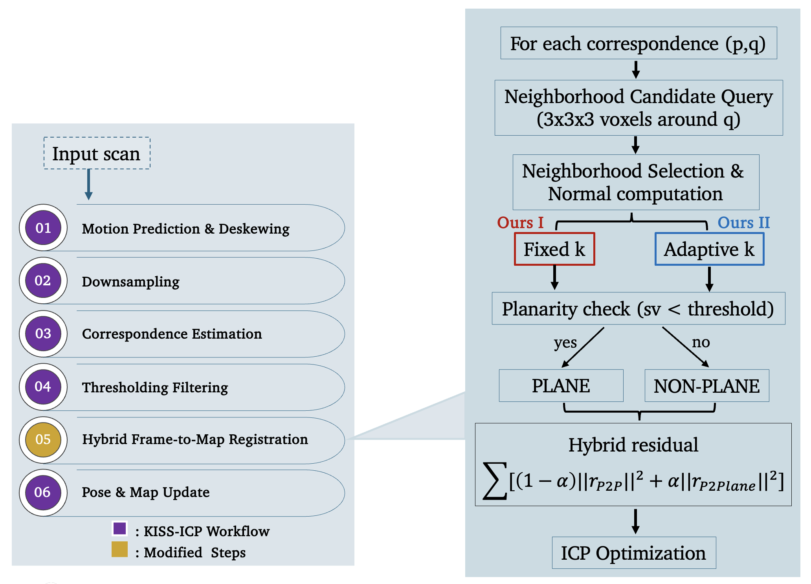

<div align="center">
    <h1>HYBRID-KISS-ICP</h1>

An extension of KISS-ICP integrating planar geometric constraints for LiDAR odometry.

<br />

<a href="https://github.com/PRBonn/kiss-icp"></a> <a href="https://github.com/kodingson900104/HYBRID-KISS-ICP/blob/main/LICENSE"></a> <a href="https://github.com/kodingson900104/HYBRID-KISS-ICP"></a> <a href="https://github.com/kodingson900104/HYBRID-KISS-ICP"></a> <a href="https://github.com/kodingson900104/HYBRID-KISS-ICP"></a>

<br />
<br />

<a href="https://github.com/PRBonn/kiss-icp">Original KISS-ICP</a> <span>  •  </span>
Paper (Coming Soon) <span>  •  </span> <a href="#install">Install</a> <span>  •  </span> <a href="#method-selection">Method Selection</a> <span>  •  </span> <a href="#citation">Citation</a>

<br />
<br />

**Point or Plane? Improved KISS-ICP with Integrated Plane Geometry for Engineering Geodesy Applications**

</div>

<hr />

## Overview

KISS-ICP is a highly efficient and robust LiDAR odometry framework based on point-to-point ICP registration.

This repository extends the original KISS-ICP framework by integrating planar geometric constraints into the registration process while preserving the simplicity and efficiency of the original design.

The objective of this work is to investigate whether planar information can improve registration accuracy in structured environments without significantly sacrificing computational performance.

The proposed methods were evaluated on:

* KITTI Odometry Dataset
* MulRan Dataset
* Newer College Dataset

using both relative and absolute trajectory evaluation metrics.

---

## What's New

Compared to the original KISS-ICP implementation, this repository provides three registration variants:

### 1. Point-to-Plane ICP

A pure point-to-plane ICP implementation used as a baseline method.

### 2. Hybrid Fixed Neighborhood

A hybrid registration framework combining:

* Point-to-point constraints
* Point-to-plane constraints

Surface normals are estimated using a fixed neighborhood size.

### 3. Hybrid Adaptive Neighborhood

An extension of the hybrid framework where neighborhood size is selected adaptively using eigen-entropy.

The adaptive strategy aims to improve local geometric estimation by adjusting the neighborhood size according to local surface structure.

---

## Pipeline

<!-- Replace with actual figure later -->

<p align="center">
  
</p>

*Figure: Overview of the proposed Hybrid KISS-ICP framework.*

---

## Main Modifications

The primary modifications are located in:

```text
cpp/kiss_icp/core/Registration.cpp
```

Additional supporting modifications may be present in related registration components.

All remaining modules follow the original KISS-ICP implementation.

---

## Method Selection

Three registration variants are implemented in `Registration.cpp`:

* Point-to-Plane ICP
* Hybrid Fixed Neighborhood
* Hybrid Adaptive Neighborhood

To switch between methods:

1. Open:

```text
cpp/kiss_icp/core/Registration.cpp
```

2. Activate the desired registration variant.

3. Comment out the remaining variants.

4. Rebuild the project.

Only one variant should be active at a time.

---

## Datasets

The datasets used in this work are publicly available:

* KITTI Odometry Dataset
* MulRan Dataset
* Newer College Dataset

Datasets are not distributed with this repository.

Please download them from their official sources and follow the original KISS-ICP data preparation procedure.

---

## Installation

This repository is based on the original KISS-ICP framework. Therefore, the installation procedure is largely identical to the original implementation.

Clone the repository:

```sh
git clone https://github.com/kodingson900104/HYBRID-KISS-ICP.git
cd HYBRID-KISS-ICP
```

Install the package from source:

```sh
pip install .
```

After installation, verify that the package is available:

```sh
kiss_icp_pipeline --help
```

The command-line interface remains compatible with the original KISS-ICP implementation.

For advanced usage and configuration options, please refer to:

```text
python/README.md
```

---


## Experimental Results

The proposed methods were evaluated on:

* KITTI
* MulRan
* Newer College

Evaluation metrics include:

* Absolute Trajectory Error (ATE)
* Relative Translation Error (RTE)
* Relative Rotation Error (RRE)

Detailed quantitative results and figures will be added in a future update.

---

## Based On

This repository is built upon the original KISS-ICP implementation:

https://github.com/PRBonn/kiss-icp

We gratefully acknowledge the original authors for making their implementation publicly available.

---

## Citation

### Original KISS-ICP

If you use this repository, please cite the original KISS-ICP paper:

```bibtex
@article{vizzo2023ral,
  author    = {Vizzo, Ignacio and Guadagnino, Tiziano and Mersch, Benedikt and Wiesmann, Louis and Behley, Jens and Stachniss, Cyrill},
  title     = {{KISS-ICP: In Defense of Point-to-Point ICP -- Simple, Accurate, and Robust Registration If Done the Right Way}},
  journal   = {IEEE Robotics and Automation Letters (RA-L)},
  pages     = {1029--1036},
  doi       = {10.1109/LRA.2023.3236571},
  volume    = {8},
  number    = {2},
  year      = {2023},
  codeurl   = {https://github.com/PRBonn/kiss-icp},
}
```

### This Work

Citation information will be added once the manuscript is accepted for publication.

---

## Acknowledgements

This work is built upon the original KISS-ICP framework developed by the Autonomous Intelligent Systems Group, University of Bonn.

We sincerely thank the original authors for making their implementation publicly available and for their contribution to the LiDAR odometry community.
